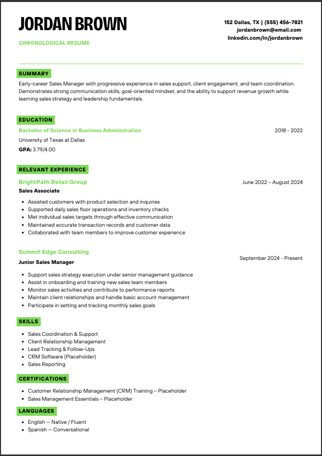

# RapidApply Resume Builder

A modern, fast, and intuitive resume builder built with Next.js 16, React 19, and Tailwind CSS 4. Create professional resumes in minutes with real-time preview and multiple export options.



## 🚀 Features

### Core Functionality
- **Real-time Preview**: See changes instantly as you type
- **Multi-Step Workflow**: Guided process from template selection to download
- **Local Storage**: All data saved locally, no server required
- **TypeScript**: Full type safety throughout the application

### Templates & Customization
- **4 Professional Templates**:
  - **Classic** - Traditional professional layout
  - **Modern** - Contemporary design with clean lines
  - **Sidebar** - Two-column layout with side information
  - **Creative** - Modern creative design for non-traditional roles
- **Rich Styling Options**:
  - 5 font choices (Inter, Roboto, Open Sans, Lato, Montserrat)
  - Custom accent colors with predefined themes
  - Adjustable font sizes (small, medium, large)
  - Spacing options (compact, normal, relaxed)

### Resume Sections
- **Personal Information** - Contact details, summary, career objective
- **Work Experience** - Job history with descriptions and achievements
- **Education** - Academic background with GPA support
- **Skills** - Technical and soft skills with categorization
- **Certifications** - Professional certifications and achievements
- **Projects** - Portfolio projects with technologies
- **Community Service** - Volunteer work and involvement
- **Leadership** - Leadership roles and experiences
- **References** - Professional references
- **Languages** - Language proficiency levels

### Export Options
- **PDF**: High-quality print-ready documents with A4 sizing
- **DOCX**: Editable Word documents with proper formatting
- **TXT**: Plain text data for easy copying

### User Experience
- **Responsive Design**: Works on all screen sizes
- **Progress Indicators**: Clear navigation flow
- **Form Validation**: Input validation and error handling
- **Accessibility**: Built with accessibility in mind
- **Privacy First**: No data sent to servers

## 🛠️ Tech Stack

- **Framework**: [Next.js 16](https://nextjs.org/) (App Router)
- **Library**: [React 19](https://react.dev/)
- **Styling**: [Tailwind CSS 4](https://tailwindcss.com/)
- **Language**: [TypeScript](https://www.typescriptlang.org/)
- **UI Components**: [Radix UI](https://www.radix-ui.com/)
- **Icons**: [Lucide React](https://lucide.dev/)
- **PDF Generation**: [jsPDF](https://github.com/parallax/jsPDF) & [html2canvas](https://html2canvas.hertzen.com/)
- **DOCX Generation**: [docx](https://docx.js.org/)
- **File Saving**: [file-saver](https://github.com/eligrey/FileSaver.js/)
- **Class Variance**: [class-variance-authority](https://cva.style/)
- **Tailwind Merge**: [tailwind-merge](https://github.com/dcastil/tailwind-merge)

## 📦 Getting Started

### Prerequisites

- Node.js (v18 or higher)
- npm or yarn or pnpm

### Installation

1. Clone the repository:
   ```bash
   git clone https://github.com/JubrilKolade/resume-builder.git
   cd resume-builder
   ```

2. Install dependencies:
   ```bash
   npm install
   # or
   yarn install
   # or
   pnpm install
   ```

3. Run the development server:
   ```bash
   npm run dev
   # or
   yarn dev
   # or
   pnpm dev
   ```

4. Open [http://localhost:3000](http://localhost:3000) with your browser to see the result.

## 📂 Project Structure

```
├── app/                     # Next.js App Router directory
│   ├── download/            # Download page with export options
│   ├── edit/                # Resume editing interface
│   ├── preview/             # Live preview with customization
│   ├── layout.tsx           # Root layout with fonts and context
│   ├── page.tsx             # Landing page and template selection
│   └── globals.css          # Global styles
├── components/              # React components
│   ├── forms/               # Form components for each resume section
│   │   ├── PersonalInfoForm.tsx
│   │   ├── WorkExperienceForm.tsx
│   │   ├── EducationForm.tsx
│   │   ├── SkillsForm.tsx
│   │   ├── CertificationsForm.tsx
│   │   ├── CommunityForm.tsx
│   │   ├── LeadershipForm.tsx
│   │   └── ReferencesForm.tsx
│   ├── templates/           # Resume template components
│   │   ├── ClassicTemplate.tsx
│   │   ├── ModernTemplate.tsx
│   │   ├── SidebarTemplate.tsx
│   │   └── CreativeTemplate.tsx
│   ├── ui/                  # Reusable UI components (Radix UI)
│   │   ├── button.tsx
│   │   ├── card.tsx
│   │   └── dropdown-menu.tsx
│   ├── ResumeForm.tsx       # Main form orchestrator with tabs
│   ├── ResumePreview.tsx    # Template renderer with lazy loading
│   ├── StyleCustomizer.tsx  # Real-time style customization
│   └── TemplateSelector.tsx # Template selection interface
├── contexts/                # React Context for state management
│   └── ResumeContext.tsx    # Global resume state with localStorage
├── types/                   # TypeScript type definitions
│   └── resume.ts            # Complete resume data interfaces
├── utils/                   # Utility functions
│   ├── defaultData.ts       # Default resume structure
│   ├── docx-generator.ts    # Word document generation
│   ├── helpers.ts           # Helper functions
│   ├── pdf-generator.ts     # Advanced PDF generation
│   └── themeUtils.ts        # Theme management utilities
├── lib/                     # Library utilities
│   └── utils.ts             # Utility functions
├── public/                  # Static assets
├── .gitignore               # Git ignore file
├── package.json             # Dependencies and scripts
├── tailwind.config.js       # Tailwind CSS configuration
├── tsconfig.json            # TypeScript configuration
├── next.config.ts           # Next.js configuration
└── README.md                # This file

## 🤝 Contributing

Contributions are welcome! Please feel free to submit a Pull Request. For major changes, please open an issue first to discuss what you would like to change.

### Development Guidelines
- Follow the existing code style and TypeScript patterns
- Use Tailwind CSS for styling
- Ensure components are properly typed
- Test changes thoroughly before submitting

## 📄 License

This project is licensed under the MIT License - see the [LICENSE](LICENSE) file for details.

## 🙏 Acknowledgments

- Built with modern web technologies
- Icons provided by [Lucide](https://lucide.dev/)
- UI components powered by [Radix UI](https://www.radix-ui.com/)
- Styling with [Tailwind CSS](https://tailwindcss.com/)
